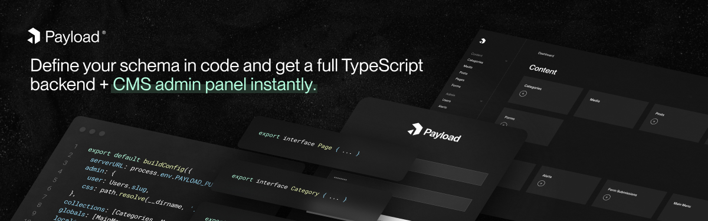

<h1 align="center">Hello! I'm Elliot 👋</h1>

  
  

  <h3>Currently working on <a href="https://github.com/payloadcms/payload">Payload</a><h3>
  

### 💻 GitHub Stats

  
  
  

### 📕 Latest Blog Posts

<!--START_SECTION:posts-->
* [Backup and Restore Visual Studio Code Extensions from the Command Line](https:&#x2F;&#x2F;elliotdenolf.com&#x2F;blog&#x2F;backup-and-restore-visual-studio-code-extensions-from-the-command-line)
* [Bootstrap your Dotfiles with dotbot](https:&#x2F;&#x2F;elliotdenolf.com&#x2F;blog&#x2F;bootstrap-your-dotfiles-with-dotbot)
* [Build .NET 5 Applications with GitHub Actions](https:&#x2F;&#x2F;elliotdenolf.com&#x2F;blog&#x2F;build-net-5-applications-with-github-actions)
* [Build .NET Core Applications using GitLab CI](https:&#x2F;&#x2F;elliotdenolf.com&#x2F;blog&#x2F;build-net-core-applications-using-gitlab-ci)
* [Chromebook For Development - 1 Year In](https:&#x2F;&#x2F;elliotdenolf.com&#x2F;blog&#x2F;chromebook-for-development-1-year-in)
* [C# Scripting using dotnet-script](https:&#x2F;&#x2F;elliotdenolf.com&#x2F;blog&#x2F;csharp-scripting-using-dotnet-script)
* [Cucumber.js with TypeScript](https:&#x2F;&#x2F;elliotdenolf.com&#x2F;blog&#x2F;cucumberjs-with-typescript)
* [Easily Rerun EC2 UserData](https:&#x2F;&#x2F;elliotdenolf.com&#x2F;blog&#x2F;easily-rerun-ec2-userdata)
* [My Tech Podcasts: Summer 2020 Edition](https:&#x2F;&#x2F;elliotdenolf.com&#x2F;blog&#x2F;my-tech-podcasts-summer-2020-edition)
* [Nvm alternative for Node.js version management with asdf](https:&#x2F;&#x2F;elliotdenolf.com&#x2F;blog&#x2F;nvm-alternative-for-nodejs-version-management-with-asdf)
<!--END_SECTION:posts-->
